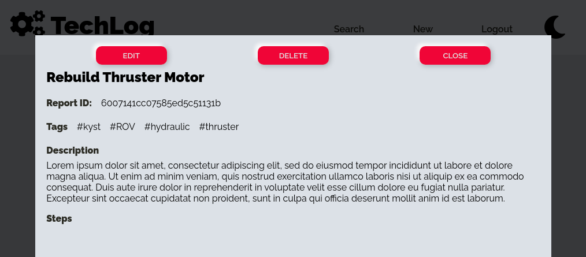
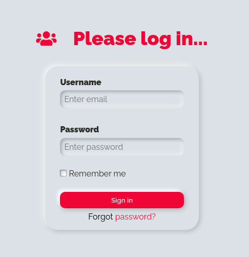

# TechLog

Techlog is a web app that aims to be a technicians log for sharing information. You can find the original repository here: https://github.com/DanB-Web/TechLog

## Our project

The goal of this project was to take a full-stack project from another developer and add robustness to it by migrating from JavaScript to TypeScript and implementing automated tests, both in the back end and the front end.

## Contributors

This project was developed as part as Codeworks' immersive coding bootcamp. The members of the team were:

* Dalton Klein: https://github.com/Dalton-Klein
* Guillem Garcia: https://github.com/guillemgarciagomez

## Achievements

 *  We succesfully implemented Typescript across the whole application.
### Back end

* In the backend we added integration tests using mocha, chai and supertest to all the controller functions, obtaining a coverage of over 90% in the whole server.

### Front end

* We used Jest, and React Testing Library to thoroughly test all the components and services, achieving a coverage of 88%.

* We refactored the different forms across the project to follow React's best practices, reducing a lot the code complexity and improving the readability.

* Implemented a new feature: an admin user can edit a log by clicking a single button (the old implementation required copying the log ID and heading to a separate page to do the editing).

* Style: we worked on the design of the app to give it a _neumorphic_ feel, using colors and shadows to add an appearance of volume to the components.

